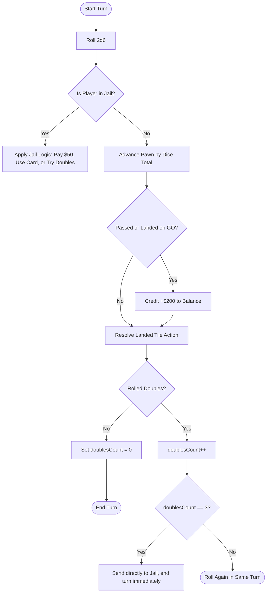

# Monopoly Rules Engine & Game Logic Skill

A definitive guide, mathematical models, and state-machine specifications for implementing an authentic, glitch-free Monopoly rules engine in modern web applications.

---

## 1. 40-Tile Board Layout & Indices

A standard Monopoly board consists of 40 tiles indexed `0` to `39` starting from **GO** (bottom-right corner) moving clockwise:

| Range | Side / Position | Description |
| :--- | :--- | :--- |
| `0` | Bottom-Right Corner | **Merkez Şantiye (Başlangıç)** (200₺ maaş tahsil edilir) |
| `1 - 9` | Bottom Row (South) | Ulus (60₺), Belediye & İmar, Dışkapı (60₺), Gelir Vergisi (200₺), Ankara Tren Garı (200₺), Mamak (100₺), İhale & Fırsat, Keçiören (100₺), Yenimahalle (120₺) |
| `10` | Bottom-Left Corner | **Maliye Denetimi (Kodes / Ziyaretçi)** |
| `11 - 19` | Left Row (West) | Altındağ (140₺), Başkent EDAŞ (150₺), Demetevler (140₺), Etlik (160₺), Söğütözü Garı (200₺), Etimesgut (180₺), Belediye & İmar, Batıkent (180₺), Eryaman (200₺) |
| `20` | Top-Left Corner | **Dinlenme Tesisi (Mola)** (Güvenli bekleme sahası) |
| `21 - 29` | Top Row (North) | Bahçelievler 7. Cadde (220₺), İhale & Fırsat, Emek (220₺), Kızılay Meydanı (240₺), Marşandiz Garı (200₺), Tunalı Hilmi (260₺), Kocatepe (260₺), ASKİ Su İdaresi (150₺), Gaziosmanpaşa GOP (280₺) |
| `30` | Top-Right Corner | **Vergi İncelemesi! (Müfettiş)** (Doğrudan 10. kare Maliye Denetimi'ne sevk) |
| `31 - 39` | Right Row (East) | Çankaya Atakule (300₺), Çayyolu (300₺), Belediye & İmar, Ümitköy (320₺), Eryaman YHT Garı (200₺), İhale & Fırsat, Bilkent (350₺), Lüks Vergisi (100₺), İncek / Beysukent (400₺) |

---

## 2. Property & Rent Mechanics

### 2.1 Color Groups and Monopolies
* A **Monopoly** is achieved when a single player owns all properties in a single color group (Brown: 2, Dark Blue: 2, All others: 3).
* **Unimproved Double Rent:** If a player owns an entire unimproved color group, the base rent of every unimproved property in that group is doubled.
* If any property in the group is mortgaged, unimproved properties in that group still charge doubled rent, but the mortgaged property charges $0.

### 2.2 Housing & Hotel Construction (The Even-Building Rule)
* Houses can only be purchased once a player owns the complete monopoly for that color group.
* **Even Building Rule:** You cannot build a second house on any property until all properties in that color group have one house. Similarly, you cannot build a third until all have two, etc. Maximum is 4 houses per property before upgrading to a Hotel (cost = price of 1 house + returning 4 houses to the bank).
* **Demolition / Selling:** Houses must also be sold back evenly at **50% of the purchase price**.
* **Bank Supply Limit (Tactical Shortage):** Official rules specify exactly 32 houses and 12 hotels. If the bank runs out of houses, players cannot build until someone sells or upgrades to a hotel.

### 2.3 Railroads Rent Formula
Let $N$ be the number of Railroads owned by the player ($N \in \{1, 2, 3, 4\}$):
$$\text{Rent} = 25 \times 2^{N-1} \quad \implies \quad 1: \$25, \; 2: \$50, \; 3: \$100, \; 4: \$200$$

### 2.4 Utilities Rent Formula
Let $D$ be the sum of the dice rolled that landed on the utility:
* **1 Utility Owned:** $\text{Rent} = 4 \times D$
* **2 Utilities Owned:** $\text{Rent} = 10 \times D$
* *Card Redirect Clause:* When a Chance/Community Chest card directs a player to the nearest Utility, rent is $10 \times D$ regardless of how many utilities are owned.

---

## 3. Mortgage and Liquidation Rules

1. **Mortgage Value:** Exactly 50% of the printed property purchase price.
2. **Pre-condition:** All houses and hotels on the entire color group must be sold to the bank at 50% value before any property in that group can be mortgaged.
3. **Unmortgaging Cost:** 
   $$\text{Unmortgage Cost} = \text{Mortgage Value} + (\text{Mortgage Value} \times 0.10) = 1.10 \times \text{Mortgage Value}$$
4. **Trading Mortgaged Properties:** A mortgaged property can be traded. The recipient must immediately pay 10% interest or pay the full 110% to unmortgage it immediately.

---

## 4. Dice Rolling, Doubles, and Turn Flow

---

## 5. Official Auction Protocol

According to official standard rules:
> "Whenever you land on an unowned property you may buy that property from the Bank at its printed price. If you do not wish to buy it, the Banker sells it at auction to the highest bidder. Any player, including the one who declined the option to buy it, may bid."

* **Auction Trigger:** Player clicks "Pass / Decline" on an unowned tile.
* **Auction State Machine:**
  1. Set `currentBid = 10` (or $1). Highest bidder = null.
  2. Start a countdown timer (e.g., 10 seconds).
  3. Every valid bid ($bid \ge currentBid + minIncrement \land bidderBalance \ge bid$) updates highest bidder and resets the countdown timer to 5 seconds.
  4. If countdown expires with a highest bidder: deduct bid amount from winner, assign property deed, announce winner.
  5. If no bids occur, property remains with the bank.

---

## 6. Jail Mechanics & Escape Conditions

A player is sent to Jail via:
1. Landing on tile 30 ("Go to Jail").
2. Drawing a "Go directly to Jail" card from Chance or Community Chest.
3. Rolling three consecutive doubles in a single turn.

### Jail Status Rules:
* While in jail, a player **can still collect rent, trade, build houses, and bid in auctions**.
* To get out of jail on their turn, a player can:
  1. Roll doubles on their roll turn (if doubles rolled, move that distance; do not roll again).
  2. Pay a $50 fine before rolling.
  3. Use a "Get Out of Jail Free" card before rolling.
* **3-Turn Limit:** If the player fails to roll doubles by their 3rd turn in jail, they **must** pay $50 (or go bankrupt if unable) and then move the distance shown on the dice.

---

## 7. Bankruptcy & Debt Settlement

Bankruptcy occurs when a player owes more money than their total liquid cash plus mortgage/sale value of all assets:

1. **Owed to another player:**
   - All remaining cash and mortgaged/unmortgaged properties are transferred to the creditor.
   - Any houses/hotels must first be sold to the bank at half price to satisfy cash debt.
   - The creditor must immediately pay 10% interest on all mortgaged properties received.
2. **Owed to the Bank (taxes, fees):**
   - All properties are surrendered to the bank. All mortgages are cancelled.
   - The bank immediately auctions off each surrendered property to the remaining players.
3. **Player Elimination:** Player is flagged `isBankrupt: true`, tokens removed from active play. If only 1 player remains, that player is declared the Winner.
