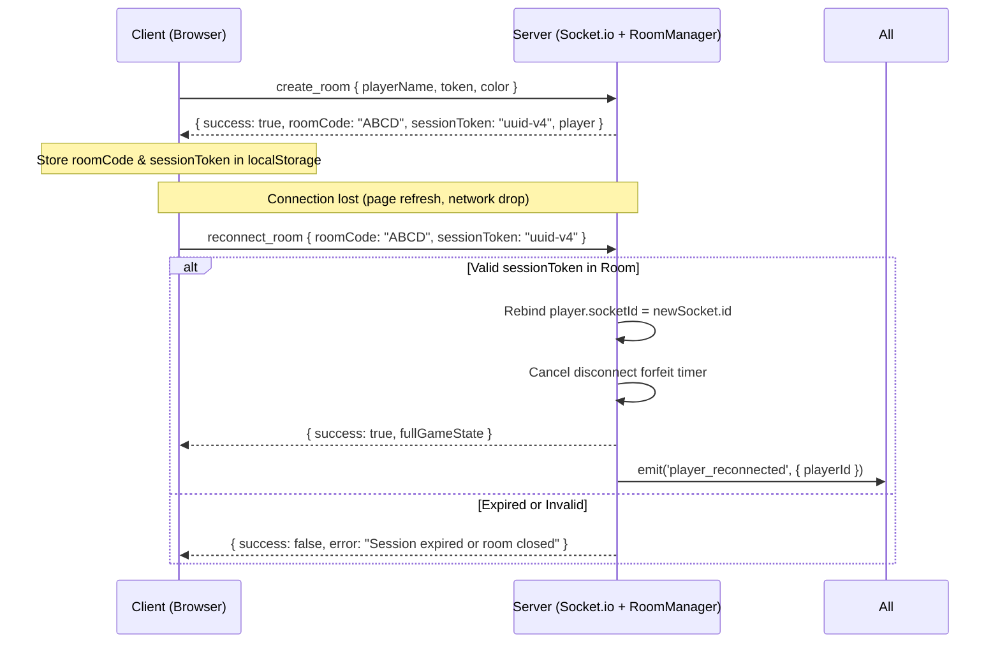

# Multiplayer Board Game WebSockets & Sync Architecture Skill

Guidelines, network topologies, and production protocols for building robust, cheat-proof multiplayer board games using Node.js and Socket.io.

---

## 1. Server-Authoritative Architecture

Never trust client state. In a multiplayer board game, clients are strictly **display terminals and input dispatchers**:

* **Client Responsibility:**
  - Send player intent (e.g., `emit('action:roll_dice')`, `emit('action:buy_property')`, `emit('action:propose_trade', data)`).
  - Render received state from server with smooth local animations.
* **Server Responsibility:**
  - Generate cryptographically sound pseudo-random numbers for dice rolls (`Math.floor(Math.random() * 6) + 1`).
  - Validate player turn, status (e.g. not bankrupt, not waiting for trade acceptance).
  - Calculate money deductions, rent formulas, property transfers.
  - Broadcast canonical `game_state` snapshot or event deltas to all connected sockets in the room.

---

## 2. Room Lifecycle & Session Reconnection



### Reconnection Best Practices:
1. **Never use Socket ID as the primary player identifier.** Use a persistent `playerId` or `sessionToken` (e.g. `crypto.randomUUID()`).
2. **Grace Period on Disconnect:**
   - When a socket disconnects, mark player `isConnected = false`.
   - Start a 60-second grace timer.
   - If timer expires and game is active, either auto-bankrupt the player, convert them to a temporary AI bot, or pass their turn.

---

## 3. Atomic Actions & Race-Condition Prevention

Multiplayer board games have scenarios where simultaneous actions collide:
* **Concurrent Auction Bids:** Multiple players click bid within 50ms.
* **Trade Acceptance vs Property Mortgage:** Player A accepts a trade giving Property X to Player B while Player B is attempting to mortgage Property X.

### The Lock / Mutex Pattern:
Wrap room state mutations in a synchronous queue or turn mutex:
```javascript
class RoomGameLock {
  constructor() {
    this.isLocked = false;
  }
  
  async execute(actionFn) {
    if (this.isLocked) {
      throw new Error("Game state is currently processing another transaction");
    }
    this.isLocked = true;
    try {
      return await actionFn();
    } finally {
      this.isLocked = false;
    }
  }
}
```

---

## 4. Turn Timers & AFK Auto-Play

To prevent abandoned sessions from stalling active players:
1. Store `turnStartTime = Date.now()` on every turn transition.
2. Server runs a global heartbeat loop (every 1000ms):
   ```javascript
   const elapsed = (Date.now() - game.turnStartTime) / 1000;
   if (elapsed > game.turnTimeLimit) {
     game.forceTimeoutTurn(activePlayer.id);
     io.to(game.roomCode).emit('game_state', game.getPublicState());
   }
   ```
3. Auto-play fallback on timeout:
   - If hasn't rolled: roll dice automatically.
   - If landed on unowned property: pass to auction or decline.
   - End turn immediately.

---

## 5. Socket.io Event Dictionary

| Event Name | Direction | Payload Example | Description |
| :--- | :--- | :--- | :--- |
| `create_room` | Client $\to$ Server | `{ playerName, token, color }` | Initializes a new game room |
| `join_room` | Client $\to$ Server | `{ roomCode, playerName, token }` | Joins an existing game room |
| `game_state` | Server $\to$ Client | Full `GameState` object | Canonical board & player sync |
| `action:roll_dice` | Client $\to$ Server | `{}` | Requests dice roll |
| `action:buy_tile` | Client $\to$ Server | `{ tileIndex }` | Purchase landed unowned tile |
| `action:auction_bid` | Client $\to$ Server | `{ bidAmount }` | Place bid in active auction |
| `action:build_house` | Client $\to$ Server | `{ tileIndex }` | Construct house on owned street |
| `action:mortgage` | Client $\to$ Server | `{ tileIndex }` | Toggle mortgage status |
| `action:trade` | Client $\to$ Server | `{ targetPlayerId, offer, request }`| Propose trade |
| `action:end_turn` | Client $\to$ Server | `{}` | Completes active player's turn |
| `chat_message` | Both | `{ sender, text, timestamp }` | In-game chat communication |
